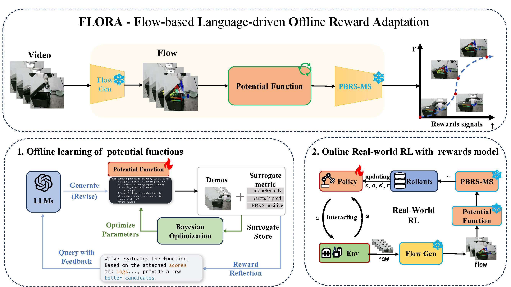
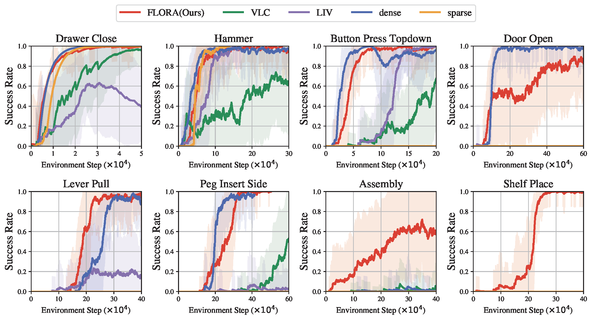
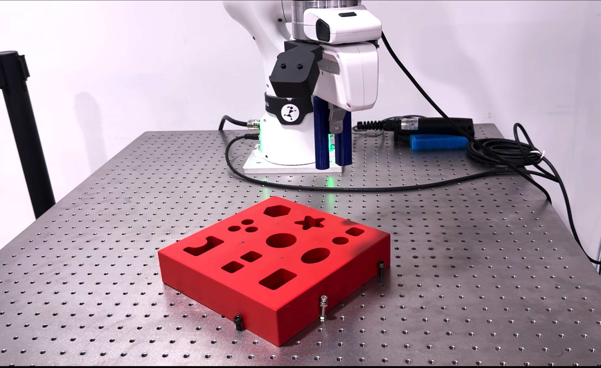
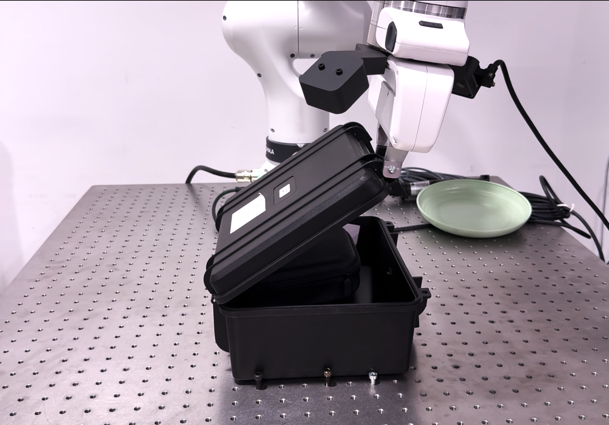
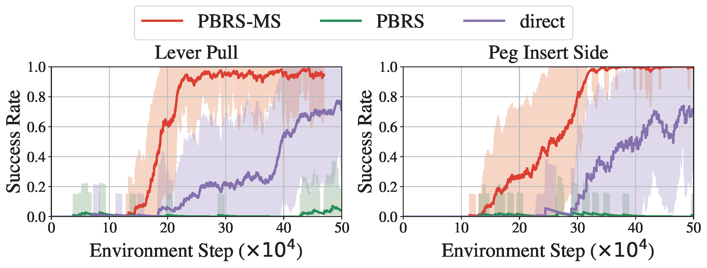

# Official Code for ICLR 2026 Submission ID: 24618

## FLORA: Generalizable Motion-Flow-Based Reward Shaping for Scalable Real-World Robot Learning

This repository provides supplementary materials for our ICLR 2026 submission. Below we highlight our framework overview and key experimental results.

> **Abstract:** Designing dense rewards for real-world robot reinforcement learning is a critical bottleneck. To overcome this, we introduce **FLORA** (**F**low-based **L**anguage-driven **O**ffline **R**eward **A**daptation). Our framework uses Large Language Models (LLMs) to automatically generate theoretically-sound reward functions from just 3-5 demonstrations. FLORA operates on motion flow from raw pixels, requires no privileged state information, and guarantees optimal policy invariance. An offline refinement procedure ensures high-quality rewards without expensive online training. Extensive experiments show that FLORA significantly outperforms strong baselines, enabling sample-efficient learning on a wide range of tasks and solving complex real-world manipulation in under 20 minutes.

---

### Framework Overview


*A high-level overview of the FLORA framework. It consists of a flow generator that extracts motion flows from images, an LLM-generated potential function that computes potential values from these flows, and a PBRS-MS module that produces the final shaped reward signals.*

---

## Key Experimental Results

### Simulation Performance on Meta-World

FLORA consistently achieves strong and stable performance across eight diverse manipulation tasks, matching or surpassing the hand-crafted dense rewards baseline in both sample efficiency and final success rate.


*Learning curves of RLPD agents with different reward functions on eight Meta-World tasks. FLORA (orange) demonstrates superior performance and generality.*

### Real-World Robot Experiments

FLORA enables a Franka Research 3 (FR3) robot to solve complex, contact-rich manipulation tasks in approximately 20 minutes, where baselines using sparse rewards fail to make progress even after 60 minutes. The static setups and successful execution rollouts are shown below.

| Franka Peg Insert Deep | Franka Box Open |
| :---: | :---: |
| **Setup** | **Setup** |
|  |  |
| **Execution Rollout** | **Execution Rollout** |
|  |  |
| **Learning Process** | **Learning Process** |
| <video src="../image/real_peg_insert_deep_success_compressed3.mp4" width="320" controls></video> | <video src="../image/real_box_open_learning_process_conpressed_3.mp4" width="320" controls></video> |
[▶️ Watch Peg Insert Process (MP4)](../videos/real_peg_insert_deep_success_compressed3.mp4)

| Task                   | FLORA (Ours) @ 20 min | SERL (Baseline) @ 60 min |
| ---------------------- | --------------------- | ------------------------ |
| Franka Peg Insert Deep | **20/20** (100%)      | 0/20 (0%)                |
| Franka Box Open        | **20/20** (100%)      | 0/20 (0%)                |


### Ablation Study on Reward Shaping Structure

Our proposed PBRS-Milestone (PBRS-MS) structure significantly outperforms classical PBRS and directly using potential values as rewards, demonstrating faster convergence and higher stability.


*Ablation study on the Lever Pull and Peg Insert Side tasks, highlighting the effectiveness of our PBRS-MS formulation.*

---

### 📢 Code Status: Coming Soon

Thank you for your interest in our work. To ensure clarity, ease of use, and full reproducibility, we are currently cleaning and refactoring the codebase.

The full source code, along with experiment scripts and detailed setup instructions, will be made publicly available in this repository upon the paper's acceptance.

---

## Citation

If you find our work useful in your research, please consider citing our paper. A BibTeX entry will be provided upon publication.
```bibtex
@inproceedings{anonymous2026flora,
  title={{FLORA}: Generalizable Motion-Flow-Based Reward Shaping for Scalable Real-World Robot Learning},
  author={Anonymous},
  booktitle={International Conference on Learning Representations},
  year={2026},
  url={https://openreview.net/forum?id=24618}
}
```
